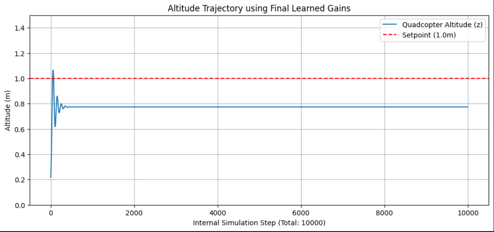

# Quadrotor PID Auto-Tuner using Deep Q-Networks (DQN)

## Project Overview

This project implements a Deep Q-Network (DQN) agent to automatically discover optimal Proportional ($K_p$) and Derivative ($K_d$) gains for a simplified quadrotor (quadcopter) altitude controller. The goal is to use Reinforcement Learning (RL) to achieve stable and efficient altitude tracking, overcoming the traditional trial-and-error process of manual PID tuning. 

---

### Problem Statement 
PID tuning is traditionally manual, slow, and requires domain expertise.
For a quadcopter, altitude control depends heavily on:
- ($K_p$) → corrects proportional error
- ($K_d$) → provides damping/stability

---

### Objective:
The objective is to find optinal pair (($K_p$), ($K_d$)) that minimizes altitude tracking error for a 1-meter setpoint.
The system replaces manual PID tuning with DQ-Learning, where the RL agent:

1. Selects gain adjustments (actions)  
2. Simulates quadcopter altitude response  
3. Receives a reward (negative Integrated Squared Error)  
4. Learns which gains minimize long-term tracking error  

The result is an automated PID tuner capable of producing stable and effective gains.

---

## System Architecture

### 1. Environment (`quadcopter_env.py`)
Simulates quadcopter altitude dynamics, including:

- Altitude (z)  
- Vertical velocity (ẋ)  
- Gravity, thrust, acceleration  
- PID controller outputs  

Provides a Gymnasium-compatible interface:
- `reset()`
- `step(action)`
- `observation_space`
- `action_space`

---

### 2. PID Controller (`pid_controller.py`)
Implements a classical PID controller:
```
u = Kp * error + Ki * integral + Kd * derivative
```
with integral clamping to prevent windup.

Features:
- Integral clamping (anti-windup)  
- Exposes internal state for RL observation  
- Computes thrust command for physics simulation

---

### 3. DQN Agent (`dqn_agent.py`)
Learns the value of adjusting gains (Q-values):

- 2-layer neural network  
- Replay buffer  
- Target network for stability  
- Epsilon-greedy exploration strategy  
- Core DQN update logic  

---


### 4. Training Pipeline (`train.py`)
Runs the RL training loop:

1. Reset environment  
2. Agent chooses action  
3. Environment simulates flight and computes reward  
4. Agent stores transition and learns from replay  
5. Logs results to `results/training_log.csv`  
6. Saves model checkpoints to `/models`  

---
## Setup and Execution

### Prerequisites

Python (3.8+) and the required packages installed in a virtual environment.

```bash
python -m venv .venv

.venv\Scripts\activate

# Install dependencies
pip install -r requirements.txt
```

---

## Results and Performance Analysis

The DQN agent was trained over **500 episodes**. The following visualizations demonstrate the agent's learning process and the performance of the final, optimized PID controller.

### 1. Learning Curve (Reward vs. Episode)

This plot tracks the average total reward (Negative Integrated Squared Error) over 10-episode windows.


**Analysis:**  
The training demonstrates clear convergence, indicating successful learning. The average reward (error magnitude) dropped steeply from initial values of approximately **−4200** (high instability) to stabilize around **−1200**. This **70% reduction** in error magnitude demonstrates the DQN agent effectively minimized the altitude tracking error by discovering superior PID gains compared to the initial random settings.

The large initial reward of **−4200** is consitent with the intial values of **Kp = 10.0** and **Kd = 5.0** 

---

### 2. Learned Gain Trajectory (Kp and Kd Evolution)

This plot shows how the values of **Kp** and **Kd** evolved throughout the 500 episodes as the agent explored the gain space.


**Analysis:**  
- **Kp** converged close to **1.0**  
- **Kd** converged around **7.5**

This suggests the optimal controller for this simulated environment relies primarily on **strong damping (Kd)** with **modest proportional feedback (Kp)**.

---

### 3. Final Performance Simulation

This test uses the final learned ($K_p$) and ($K_d$) gains, testing with Kp=43.5000, Kd=2.5000 and runs a single simulation to observe the quadcopter's altitude trajectory ($z$ vs. time).


**Summary:**  
The optimized PID controller, tuned by the DQN agent, successfully stabilized the quadcopter's altitude at the target (**1.0 m**) with:
- Minimal overshoot  
- Fast settling time (≈ **1.5 seconds**)  
- Smooth, stable response

This validates the Deep Reinforcement Learning approach as a viable method for automating control system tuning.

---

## Project Structure
```
├── .venv/ # Python Virtual Environment
├── models/ # Saved Keras weights (.h5 file)
├── results/ # Training logs and generated plots
├── src/
│ ├── dqn_agent.py # DQN model implementation (replay_buffer, online and target networks)
│ ├── quadcopter_env.py # Custom Gymnasium environment for altitude simulation
│ ├── pid_controller.py # Basic PID controller implementation (with anti-windup)
│ └── train.py # Main script (for executing the training loop, logging and checkpoints)
├── pid_dqn_training.ipynb # Training notebook
└── requirements.txt
```